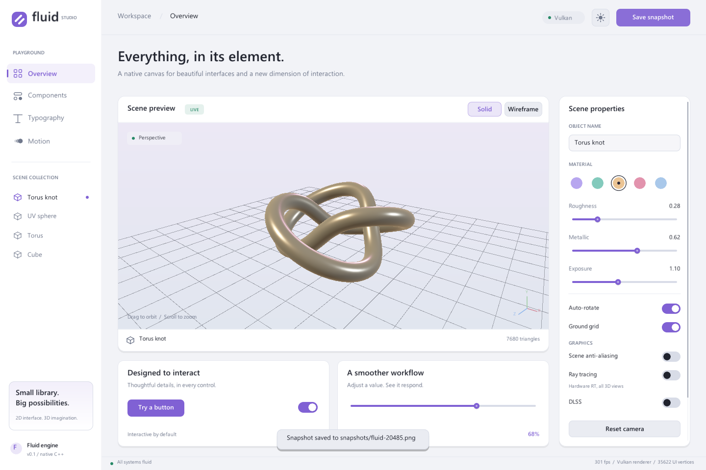

# Fluid

A native C++20 GUI library with a Vulkan renderer and embedded, depth-tested 3D views. **FluidTest** is the interactive **Fluid Studio** example: a playground for the library's controls, typography, animation, and model rendering.



## Build and run

Requirements:

- CMake 3.20 or newer and a C++20 compiler.
- The Vulkan SDK, including `glslc`, and a Vulkan-capable graphics driver.
- On Linux, the development packages required by GLFW's enabled X11/Wayland backends. On macOS, a Vulkan implementation such as MoltenVK.

GLFW, GLM, the font baker, and the PNG writer are already in `third_party`; the build does not download dependencies. Compiled shaders are embedded in the library, so the executable can be moved without a shader folder.

```sh
cmake -S . -B build
cmake --build build --config Release --parallel
ctest --test-dir build -C Release --output-on-failure
```

Fluid Studio lives in `Fluid_test` and links the static `Fluid` library:

```sh
cmake -S Fluid_test -B Fluid_test/build
cmake --build Fluid_test/build --config Release --parallel
```

Run `Fluid_test/build/Release/FluidTest.exe` with a Visual Studio generator, or `Fluid_test/build/FluidTest` with a single-configuration generator. If your CMake version predates your installed Visual Studio, use the newer CMake bundled with Visual Studio or a supported Ninja toolchain.

## Explore Fluid Studio

- **Overview:** select a torus knot, sphere, torus, or cube; drag the viewport to orbit and scroll to zoom. Edit the material color, roughness, metallic value, and exposure. Toggle rotation, the ground grid, wireframe, 3D anti-aliasing, ray tracing, and DLSS. Reset the camera at any time. GUI anti-aliasing is always on when the GPU supports MSAA.
- **Bring your own model:** drop a Wavefront `.obj` file onto the window, enter its path in Scene properties, or launch with `--model path/to/model.obj`. The importer handles normals, negative indices, and concave polygon faces, and centers and scales the geometry. Material libraries and textures are not imported.
- **Components:** try buttons, switches, editable text, sliders, and progress indicators. Values are shared with the overview. Use Tab/Shift+Tab to move focus, Enter/Space to activate controls, and arrow keys to adjust sliders.
- **Typography:** edit a live type sample and change its size.
- **Motion:** pause, restart, and adjust a time-based 2D animation.
- The top bar switches light/dark appearance and saves PNG snapshots into `snapshots/` relative to the working directory. Scroll the properties panel when the window is short.

An original flat-shaded sample is included at `assets/models/crystal.obj` for trying the importer.

## Use the library

Link the `Fluid::Fluid` CMake target and include `<fluid/fluid.h>`. `Fluid::window` owns the native window, renderer, font atlas, and event loop. Override `tick()` to describe each frame using stable widget IDs. UI coordinates are logical window pixels; the renderer scales to the framebuffer on high-DPI displays.

```cpp
#include <fluid/fluid.h>

class Example : public Fluid::window {
    Fluid::Mesh model = Fluid::Mesh::knot();
    Fluid::OrbitCamera camera;
    float roughness = 0.3f;
    bool rotating = true;
    float angle = 0;

    void tick() override {
        auto& controls = ui();
        controls.panel({0, 0, width(), height()}, 0, Fluid::BackgroundShape::rectangle);
        controls.panel({20, 20, 260, 180});
        controls.label({40, 40}, "Hello, Fluid", 24, true);
        controls.slider("roughness", {40, 85, 220, 24}, roughness, .05f, 1.f);
        controls.toggle("rotate", {40, 135, 42, 24}, rotating);

        Fluid::Rect bounds{300, 20, width() - 320, height() - 40};
        if (bounds.contains(input().mouse)) {
            if (input().mouse_down) camera.orbit(input().mouse_delta);
            camera.zoom(input().scroll);
        }
        if (rotating) angle += delta_time() * .25f;
        Fluid::SceneView scene;
        scene.bounds = bounds;
        scene.mesh = &model;
        scene.camera = camera;
        scene.rotation = angle;
        scene.roughness = roughness;
        controls.scene(scene);
    }
};

int main() {
    Example app;
    app.Init();
    app.loop();
}
```

Widgets record into an internal draw list. Call `line`, `scene`, and `push_clip` when a control is not enough. Mesh objects referenced by a scene must remain alive through the end of the frame. Window operations and the event loop run on the main thread. `destroy()` is idempotent; normal stack destruction handles cleanup automatically.

Text uses an antialiased RGBA font atlas. Fluid selects installed Segoe UI, Arial, DejaVu Sans, or Liberation Sans fonts, with an embedded fallback. It includes Latin, Greek, Cyrillic, punctuation, and arrows when the selected font supports them. UTF-8 editing is supported; complex text shaping, IME composition, and platform accessibility bridges are not implemented yet.

## Validation and captures

The CPU test executables cover geometry, OBJ parsing, camera limits, UI input, keyboard focus, and draw-list clipping without opening a window. Rendering checks require a graphics device and a desktop session, including with `--hidden`.

```sh
FluidTest --frames 4 --hidden --screenshot fluid-studio.png
FluidTest --page components --frames 4 --hidden --screenshot components.png
FluidTest --smoke-test --hidden --screenshot smoke.png
```

The smoke run switches pages and primitives, exercises light appearance and wireframe, and resizes the swapchain before capturing the final overview. In debug builds the renderer uses Vulkan validation when the layer is installed. Run `FluidTest --help` for all options.

To include GPU lifecycle, resizing, screenshot, showcase, and OBJ rendering checks in CTest, configure with `-DFLUID_BUILD_GPU_TESTS=ON`. This option is off by default so headless CI does not require a desktop. Set `FLUID_BUILD_EXAMPLE=OFF` or `FLUID_BUILD_TESTS=OFF` when embedding the library in another project.

The previous unused `device_manager` placeholder has been replaced by the renderer's surface-aware graphics-device selection. The original `window_cfg`, `application_cfg`, `Init()`, `loop()`, and `destroy()` entry points are retained; `window_cfg::share` is ignored because Vulkan windows do not share OpenGL contexts.

This is an initial implementation with an immediate-mode API, explicit layout, and a single-frame renderer. GUI uses MSAA automatically. Optional window-wide 3D MSAA, hardware ray tracing, and DLSS-quality spatial upscaling apply to every embedded scene in that window. It is intended as a practical foundation for native tools and applications; it does not yet provide docking, automatic layout, texture/material import, or a retained widget tree.

Verified on Windows with MSVC in Debug and Release on an NVIDIA RTX 4070: all five test groups pass, with no Vulkan validation warnings during the Debug checks. Linux and macOS execution have not been verified.
